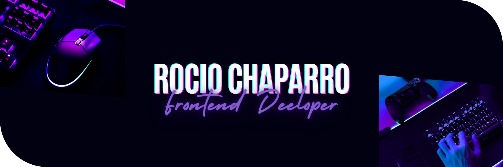
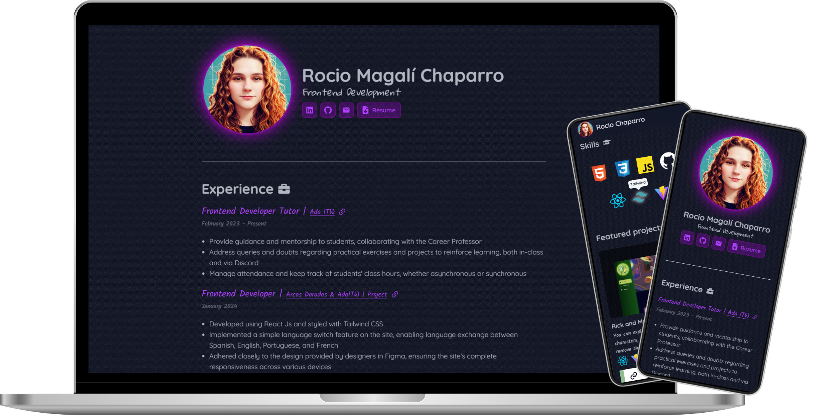

    

 
 
<!--  -->

- 🌎 I live in La Plata, Buenos Aires, Argentina
- 💻 I’m Frontend Developer
- 🎯 My skills: JavaScript, React, CSS3, HTML5, Tailwind, ViteJs
- 🌱 I’m currently learning Vue 3 with composition Api and Vuefy
- 📚 I want to learn in the near future Typescript, NextJs, Angular
- 🎓 I studied at Ada ITW, Digital Bluee, Oracle Next Education, Argentina Programa
- ❤️ I like music, animals and anime

 
 

    

 

    

 
 
 

    

 

<h5 align="center">

<!-- https://skillicons.dev/icons?i=vite,react,vue,tailwind,materialui,js -->
</h5>

<h5 align="center">

</h5>

 
 
 

    

    
    

